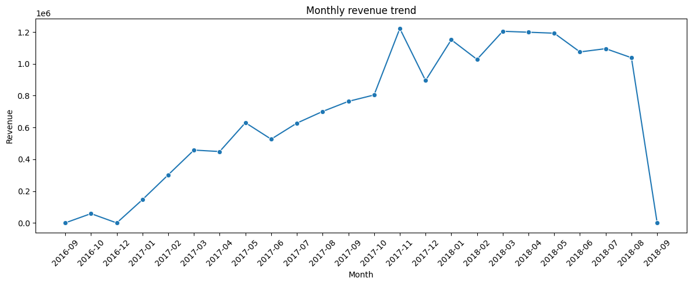
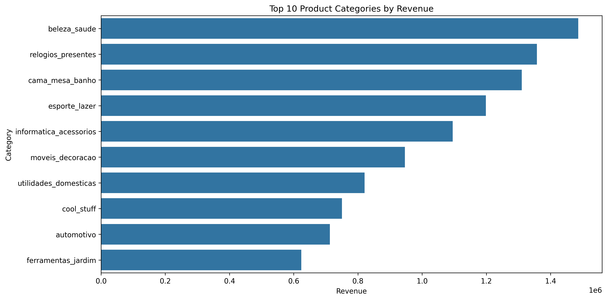
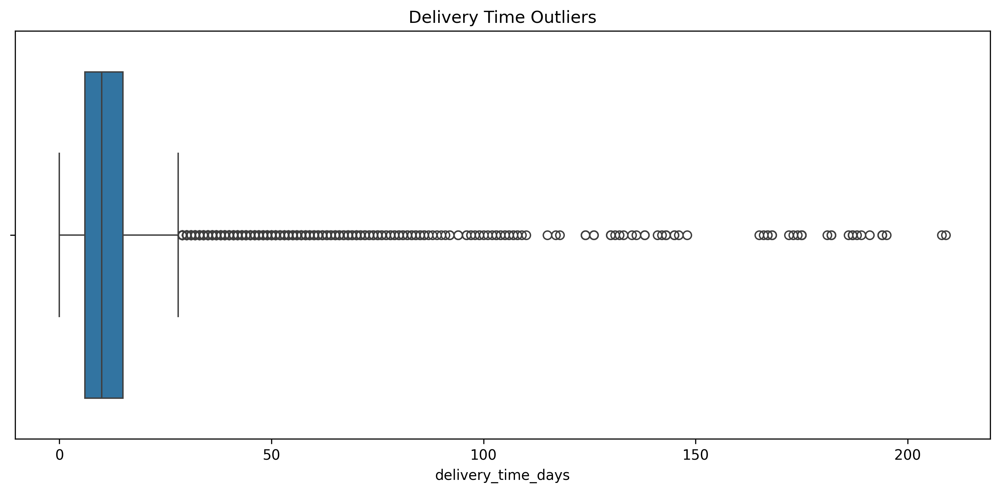

# Olist E-Commerce Business Analysis

## Project Overview

This project analyzes the Olist Brazilian E-Commerce dataset to understand customer behavior, sales trends, seller performance, and delivery efficiency. The goal is to generate business insights that can support data-driven decision making.

## Key Visualizations

### Monthly Revenue Trend

### Top Product Categories by Revenue

### Delivery Time Outliers

## Dataset

Source: Olist Brazilian E-Commerce Public Dataset

The dataset contains information about:
- Customers
- Orders
- Order Items
- Payments
- Products
- Sellers
- Reviews

The data represents real e-commerce transactions from Brazil.

## Business Questions

- How has revenue changed over time?
- Which product categories generate the highest revenue?
- Which customer regions contribute the most sales?
- Which sellers drive the largest share of revenue?
- Are there delivery delays that may affect customer experience?

## Project Workflow

1. Data Understanding
2. Data Integration (Table Joins)
3. Data Cleaning
4. Feature Engineering
5. Exploratory Data Analysis
6. Business Insights & Recommendations

## Key Findings

- Revenue varied significantly across different months.
- A small number of product categories contributed a large share of total revenue.
- Sales were concentrated in a few customer states.
- Seller performance was highly uneven.
- 71 orders experienced delivery delays exceeding 100 days.
- Extreme delays were concentrated among specific states, sellers, and product categories.

## Technologies Used

- Python
- Pandas
- NumPy
- Matplotlib
- Seaborn
- Jupyter Notebook
- Git
- GitHub

## Future Improvements

- Build an interactive dashboard using Streamlit or Power BI
- Analyze customer reviews and satisfaction
- Create delivery delay prediction models
- Develop seller performance scoring metrics

